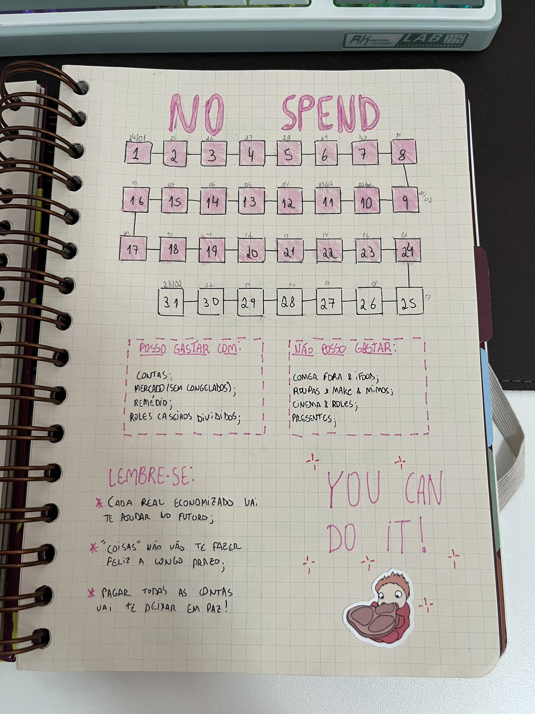
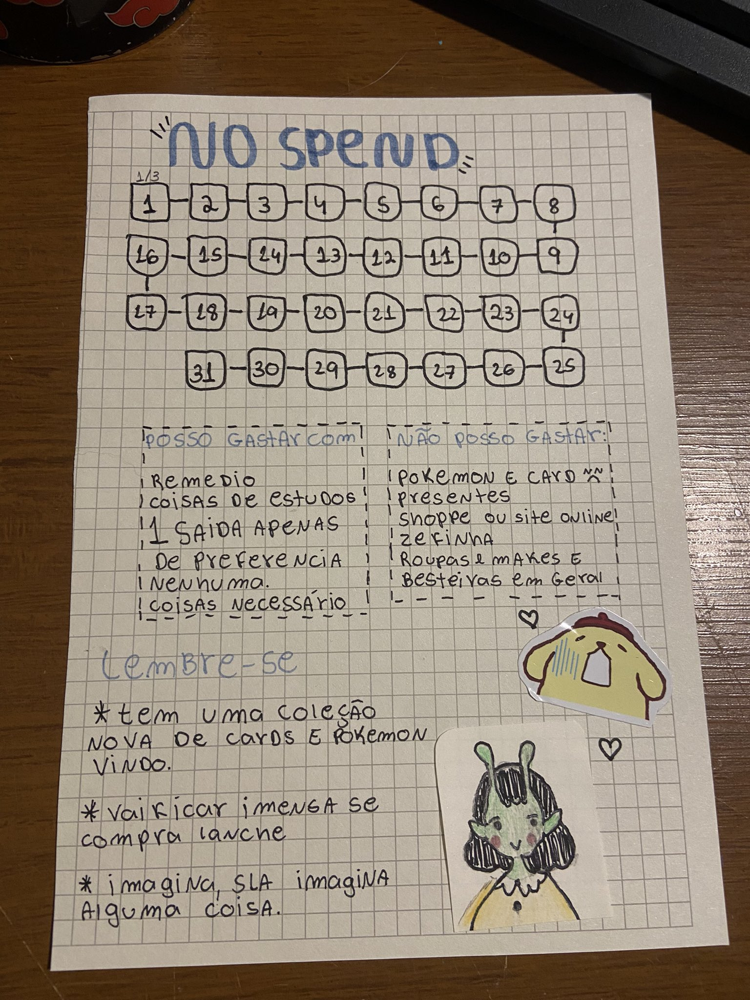
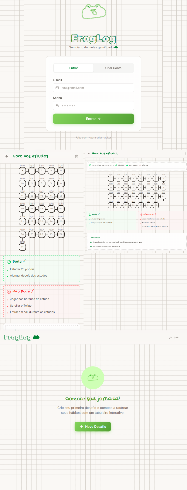

# 🐸 FrogLog

FrogLog é um rastreador de metas (goal tracker) digital inspirado em *layouts* físicos de *bullet journals* e cadernos de anotações. O nome **FrogLog** surgiu simplesmente pelo meu amor por sapos! 🐸💚 O projeto traz a sensação aconchegante, tátil e personalizada de trackers de papel para uma aplicação web ágil e fácil de usar.

## 🌟 O Conceito & Inspiração de UI/UX

A experiência de usuário (UX) e interface (UI) do FrogLog foram fortemente inspiradas por rastreadores desenhados à mão, mais especificamente baseados nos desafios de "No Spend Month" (Mês Sem Gastos) que você encontra em planners.

A ideia de criar o app surgiu depois que encontrei referências muito fofas no twitter, tentei reproduzir eu mesma no papel e ter ficado uma merda 🥲. Então decidi fazer a versão digital! Um agradecimento especial às ideias originais:
- [Desenho de referência 1 por @sopinguim](https://x.com/sopinguim/status/2027827488898871402?s=20)
- [Desenho de referência 2 por @anakarolinim](https://x.com/anakarolinim/status/2023728636528931009?s=20)

  
  

### Como traduzimos isso para o mundo digital:
1. **O Tabuleiro (Board)**: Um caminho visual simulando um jogo de tabuleiro, usado para carimbar visualmente os dias de sucesso ou falha.
2. **As Regras**: Inspirado nas caixinhas tracejadas de "Posso Gastar Com" e "Não Posso Gastar", o sistema permite listar regras do que Fazer e Evitar durante a meta.
3. **Lembretes (Lembre-se)**: Um espaço dedicado a post-its e notas motivacionais pessoais para te manter no caminho certo.
4. **Estilo "Handwritten"**: Fontes que simulam escrita à mão, fundos quadriculados que lembram folhas de caderno e designs em SVG para reter o charme *handmade*.

## 📸 Como ficou o sistema!

Veja alguns prints do FrogLog em funcionamento:

  

## 🚀 Tecnologias

- **Framework**: [Next.js](https://nextjs.org/) (App Router)
- **Estilização**: Tailwind CSS 
- **DB e Auth**: [Supabase](https://supabase.com/)
- **Deploy**: Vercel

## 🌐 Acesso ao Projeto

O projeto está no ar e pode ser acessado através do link:
👉 **[https://frogglog.vercel.app/](https://frogglog.vercel.app/)**

### � Como instalar no Celular (Aplicativo Móvel)
O FrogLog funciona como um **PWA (Progressive Web App)**, o que significa que você pode instalá-arlo diretamente no seu celular como se fosse um aplicativo nativo, sem precisar de uma loja de aplicativos!

**No iPhone (iOS / Safari):**
1. Abra o link do projeto no **Safari**.
2. Toque no ícone de "Compartilhar" (o quadrado com uma seta para cima, na barra inferior).
3. Role para baixo e selecione **"Adicionar à Tela de Início"** (Add to Home Screen).
4. Confirme tocando em "Adicionar". Pronto! O ícone do sapinho estará nos seus aplicativos.

**No Android (Chrome):**
1. Abra o link do projeto no **Google Chrome**.
2. Toque nos três pontinhos (`⋮`) no canto superior direito para abrir o menu.
3. Selecione **"Adicionar à tela inicial"** ou "Instalar aplicativo".
4. Confirme a instalação. O aplicativo aparecerá na sua tela de início!
